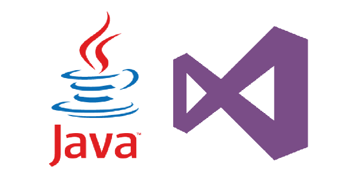

[Visual Studio Team Services (VSTS)](https://www.visualstudio.com/products/visual-studio-team-services-vs) and [Team Foundation Server (TFS)](https://www.visualstudio.com/tfs/) provide an integrated set of services and tools to manage your software projects, from planning and development through testing and deployment to speed the development and delivery of your software applications across platforms, including iOS, Android, Java, Linux or Windows. 

## Overview  of the Java Hands-on-Lab

DevOps for Java teams with Microsoft Visual Studio Team Services hands-on-lab is provided to give you a first-hand, technical experience on how you can leverage the Microsoft DevOps platform for Java development. The labs cover 
  * Creating a new VSTS account
  * Using the Agile  tools to plan and track work items  
  * Using VSTS with your Eclipse and IntelliJ
  * Running Junit tests and analyzing code coverage with Jacoco and Cobertura
  * Continuous Integration with Team Build or Jenkins
  * Managing Technical Debt with SonarQube 
  * Deploying Docker containers to Azure with an Automated delivery pipeline 

## Virtual Machine

Our partner NorthWest Cadence have built a virtual machine image that is pre-configured with all the software you require to run through the labs. You can find instructions on provisioning and connecting to the virtual machine <a href="https://github.com/nwcadence/java-dev-vsts">here</a>

## Target Audience

The image and the accompanying hand-on-labs is for technical audience. As such, familiarity with Visual Studio Team Services, Java and Linux operating system would be preferred although it is not a strict prerequisite.

## Hands on Labs

The labs should be followed in the following order, though there are some equivalent labs that allow you a "choose your adventure" experience:

1. [Setting up a new project on VSTS](creatingvstsaccount.html)
1. [Set up a Docker build agent](builddocker.html)
1. Either:
    1. [Cloning a VSTS Repo - IntelliJ](intellij-vsts.html) **OR**
    1. [Cloning a VSTS Repo - Eclipse](eclipse-vsts.html)
1. Either:
    1. [Maven Package Management with VSTS and Jenkins](maven-jenkins.html) **OR**
    1. [Maven Package Management with VSTS Team Build](maven-vsts.html)
1. [Build Docker containers with VSTS](builddocker.html)
1. (Optional) [Managing Technical Debt with SonarQube and VSTS Team Build](techdebt.html)
1. [Release Management with VSTS](deploy.html)
1. Either:
    1. [End to End Workflow - IntelliJ](intellij.html)
    1. [End to End Workflow - Eclipse](eclipsee2e.html)

